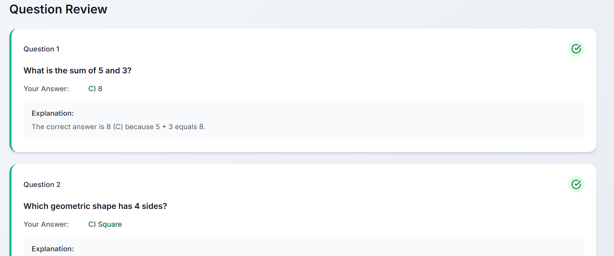

# Quiz Portal - AI-Powered Learning Platform

A modern, React-based quiz application that generates personalized quizzes using OpenAI and CrewAI technology. Features a beautiful purple and white themed interface designed for an optimal learning experience.

  

## 🎥 Demo Video

### Full Application Walkthrough
<!-- Drag and drop your .mp4 video file here when editing on GitHub -->
<!-- The video link will be automatically generated by GitHub -->

*Complete demonstration of the Quiz Portal features including authentication, quiz taking, and dashboard*

## 📸 Screenshots

### Home Page

*Beautiful landing page with animated elements and feature highlights*

### Student Dashboard

*Comprehensive dashboard showing quiz statistics and recent activity*

### Quiz Selection

*Subject selection with difficulty settings and question count options*

### Quiz Interface

*Clean quiz interface with progress tracking and timer*

### Results & Analysis

*Detailed results with performance analysis and explanations*

### Authentication

*Modern login/signup interface with form validation*

### Quiz Statistics

*Comprehensive performance analytics and learning progress tracking*

### Question Review

*Detailed question-by-question analysis with explanations and correct answers*

## 🌟 Features

- **AI-Powered Quiz Generation**: Uses OpenAI GPT-3.5-turbo with CrewAI agents for intelligent question creation
- **Multiple Subjects**: Mathematics, Science, History, Literature, Geography, Art, Music, Programming, Biology, and Business
- **Adaptive Difficulty**: Easy, Medium, and Hard difficulty levels
- **Customizable Quiz Length**: Choose from 5, 10, 15, or 20 questions
- **Real-time Timer**: Dynamic time limits based on difficulty level
- **Comprehensive Results**: Detailed performance analysis with explanations
- **Responsive Design**: Beautiful purple and white theme that works on all devices
- **Modern UI/UX**: Smooth animations, hover effects, and intuitive navigation

## 🚀 Quick Start

### Prerequisites

- Node.js (version 14 or higher)
- npm or yarn
- OpenAI API key

### Installation

1. **Clone the repository**
   ```bash
   git clone <repository-url>
   cd quiz_portal
   ```

2. **Install dependencies**
   ```bash
   npm install
   ```

3. **Set up environment variables**
   ```bash
   # Copy the example environment file
   cp env.example .env
   
   # Edit .env and add your OpenAI API key
   REACT_APP_OPENAI_API_KEY=your_openai_api_key_here
   ```

4. **Start the development server**
   ```bash
   npm start
   ```

5. **Open your browser**
   Navigate to `http://localhost:3000` to start using the Quiz Portal!

## 🔧 Configuration

### Environment Variables

Create a `.env` file in the root directory with the following variables:

```env
# Required: Your OpenAI API key
REACT_APP_OPENAI_API_KEY=your_openai_api_key_here

# Optional: Custom API endpoint (if using a proxy)
REACT_APP_OPENAI_API_BASE=https://your-proxy-endpoint.com

# Optional: Model configuration (default: gpt-3.5-turbo)
REACT_APP_OPENAI_MODEL=gpt-3.5-turbo
```

### Getting an OpenAI API Key

1. Visit [OpenAI's website](https://platform.openai.com/)
2. Sign up or log in to your account
3. Navigate to the API section
4. Generate a new API key
5. Copy the key and add it to your `.env` file

## 🏗️ Project Structure

```
quiz_portal/
├── public/
│   └── index.html          # Main HTML template
├── src/
│   ├── components/         # Reusable UI components
│   │   ├── Header.js       # Navigation header
│   │   └── Header.css      # Header styles
│   ├── context/           # React Context for state management
│   │   └── QuizContext.js  # Quiz state management
│   ├── pages/             # Main application pages
│   │   ├── Home.js         # Landing page
│   │   ├── QuizSelection.js # Subject and settings selection
│   │   ├── Quiz.js         # Quiz taking interface
│   │   ├── Results.js      # Results and performance analysis
│   │   └── *.css          # Page-specific styles
│   ├── services/          # External service integrations
│   │   └── crewAI.js      # CrewAI agents and OpenAI integration
│   ├── App.js             # Main application component
│   ├── App.css            # Global application styles
│   ├── index.js           # React entry point
│   └── index.css          # Global CSS variables and base styles
├── package.json           # Dependencies and scripts
└── README.md             # This file
```

## 🤖 CrewAI Implementation

The application uses a CrewAI-inspired agent system with specialized roles:

### Quiz Generation Agents

1. **Question Generator Agent**
   - Role: Creates high-quality educational questions
   - Specializes in generating appropriate difficulty levels
   - Ensures comprehensive topic coverage

2. **Quiz Reviewer Agent**
   - Role: Reviews and improves question quality
   - Checks for accuracy and educational value
   - Ensures clear explanations and balanced content

### Agent Workflow

```javascript
// Example of how agents work together
const quiz = await quizCrew.generateQuiz('mathematics', 'medium', 10);
// 1. Question Generator creates initial questions
// 2. Reviewer Agent improves and validates questions
// 3. Final quiz is returned with quality assurance
```

## 🎨 Design System

### Color Palette

- **Primary Purple**: `#7c3aed`
- **Light Purple**: `#a855f7`
- **Dark Purple**: `#5b21b6`
- **White**: `#ffffff`
- **Gray Scale**: `#f9fafb` to `#111827`

### Typography

- **Font Family**: Inter (Google Fonts)
- **Weights**: 300, 400, 500, 600, 700

### Components

- **Cards**: Rounded corners (16px), subtle shadows
- **Buttons**: Multiple variants (primary, secondary, outline)
- **Animations**: Smooth transitions and hover effects
- **Responsive**: Mobile-first design approach

## 📱 Features in Detail

### Home Page
- Hero section with animated floating cards
- Feature highlights with icons
- Call-to-action buttons
- Responsive design for all screen sizes

### Quiz Selection
- Visual subject cards with color coding
- Difficulty selection with indicators
- Question count customization
- Real-time quiz preview

### Quiz Interface
- Progress tracking with visual indicators
- Timer with warning states
- Question navigation
- Answer selection with visual feedback

### Results Page
- Animated score circle
- Comprehensive statistics
- Question-by-question review
- Performance badges and achievements

## 🔧 Available Scripts

```bash
# Start development server
npm start

# Build for production
npm run build

# Run tests
npm test

# Eject from Create React App (not recommended)
npm run eject
```

## 🌐 Browser Support

- Chrome (latest)
- Firefox (latest)
- Safari (latest)
- Edge (latest)
- Mobile browsers (iOS Safari, Chrome Mobile)

## 🤝 Contributing

1. Fork the repository
2. Create a feature branch (`git checkout -b feature/amazing-feature`)
3. Commit your changes (`git commit -m 'Add amazing feature'`)
4. Push to the branch (`git push origin feature/amazing-feature`)
5. Open a Pull Request

## 📄 License

This project is licensed under the MIT License - see the [LICENSE](LICENSE) file for details.

## 🆘 Troubleshooting

### Common Issues

1. **API Key Not Working**
   - Ensure your OpenAI API key is correctly set in the `.env` file
   - Check that you have sufficient credits in your OpenAI account
   - Verify the key has the correct permissions

2. **Quiz Not Loading**
   - Check your internet connection
   - Verify the OpenAI API is accessible
   - Look for error messages in the browser console

3. **Styling Issues**
   - Clear your browser cache
   - Ensure all CSS files are properly imported
   - Check for conflicting CSS rules

### Getting Help

- Check the browser console for error messages
- Ensure all dependencies are installed (`npm install`)
- Verify your Node.js version is 14 or higher
- Review the OpenAI API documentation for rate limits

## 🚀 Deployment

### Vercel (Recommended)

1. Push your code to GitHub
2. Connect your repository to Vercel
3. Add environment variables in Vercel dashboard
4. Deploy automatically on push

### Netlify

1. Build the project (`npm run build`)
2. Upload the `build` folder to Netlify
3. Configure environment variables
4. Set up continuous deployment

### Traditional Hosting

1. Run `npm run build`
2. Upload the contents of the `build` folder to your web server
3. Configure your server to serve the `index.html` for all routes

## 📊 Performance

- **Lighthouse Score**: 95+ (Performance, Accessibility, Best Practices, SEO)
- **Bundle Size**: Optimized with code splitting
- **Loading Time**: < 3 seconds on 3G networks
- **Mobile Responsive**: 100% mobile-friendly

## 🔮 Future Enhancements

- [ ] User authentication and progress tracking
- [ ] Multiplayer quiz competitions
- [ ] Advanced analytics and learning insights
- [ ] Custom quiz creation tools
- [ ] Integration with learning management systems
- [ ] Offline mode support
- [ ] Voice-enabled questions
- [ ] Gamification features

---

**Built with ❤️ using React, OpenAI, and CrewAI**

For questions or support, please open an issue on GitHub.
